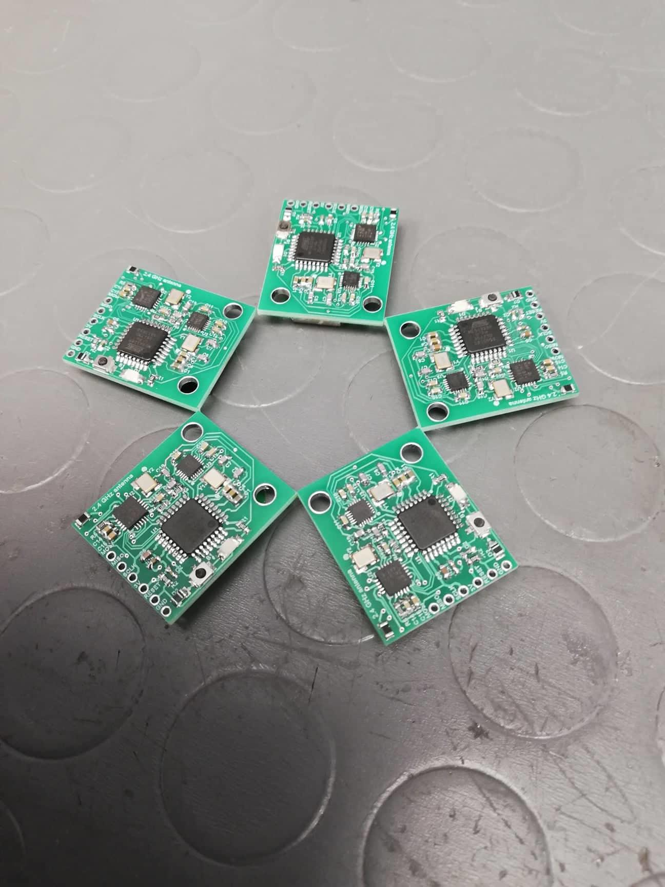

# Wireless accelerometer

Wireless accelerometer is a device, consisted of 2 pieces. One piece is sender (which also measures accelerations), second part is receiver which receives data from multiple devices and sends it to PC.

## Sender - AVR

- Sender is a PCB device that is powered by 3,3 V battery (CR2032).
- MCU is atmega328p
- Accelerometer is MPU-6500
- Wireless communication device is nRF24L01P

Device has sampling rate 1000 Hz.

## Receiver - STM32

- Receiver is a Nucle32 board powered by SMT32L476RG.
- It uses the same wireless communication device as sender.
- It can read data from 3 sensors (3 sensors; each sensor sends X, Y and Z acceleration).
- All the data is transmitted to the PC via USB cable and UART serial protocol.

## PC software

PC software is still work in progress. First try was using python and PyQt, but I will probably use Unity for graphs and data plotting.
